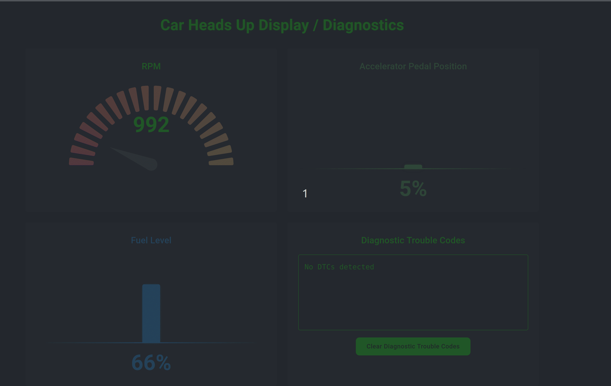
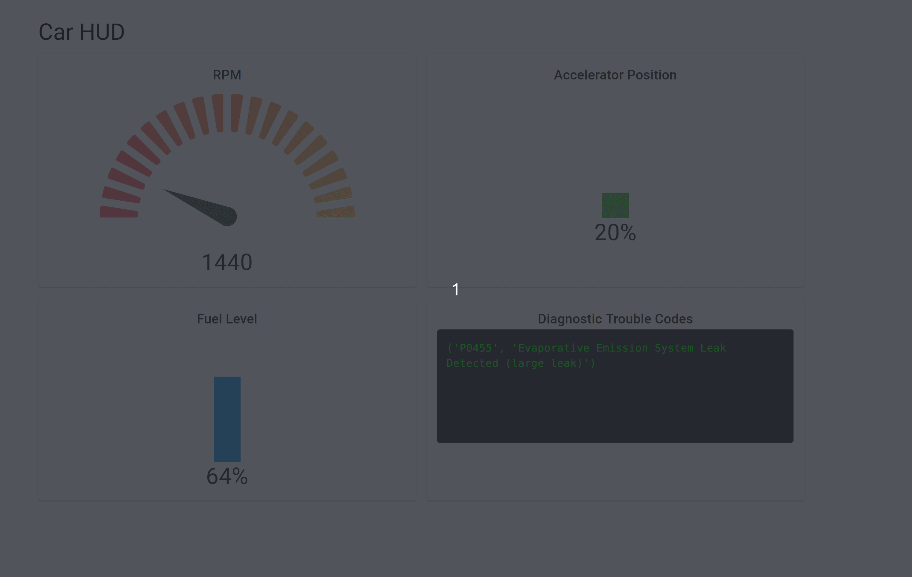

# Car Heads Up Display / Diagnostics

A real-time car diagnostics dashboard that interfaces with your car's OBD2 port to display vital information and diagnostic trouble codes (DTCs).

## Overview
In recent months, there has been a lot of talk of "vibe coding" - where developers describe their desired functionality to LLMs which then generate the corresponding code. Rather than writing code manually, the developer's role shifts to guiding the AI, testing the output, and refining the implementation. Anthropic CEO Dario Amodei is even going as far as suggesting that within 3-6 months, AI could be writing 90% of code.

As a professional software developer, I wanted to get a sense of whether this is pure hype or if I will soon be replaced by an AI agent. In order to evaluate the current state of AI code generation, I decided to use Cursor to create a small application to interface with my car using an ELM327 USB Adapter OBD2. Since the engine light was active on my dashboard, I thought this could be a good quick project.

## Features
- Real-time monitoring of:
  - Engine RPM with gauge display
  - Accelerator pedal position
  - Fuel level
  - Diagnostic Trouble Codes (DTCs)
- Ability to clear DTCs with confirmation dialog
- Modern, dark-themed UI with responsive design
- 10Hz update rate for real-time data



## Architecture
The application consists of three Docker containers:
1. **OBD2 Collector**: Python application that interfaces with the car's OBD2 port
2. **MQTT Broker**: Message broker for real-time data communication
3. **Web App**: React-based dashboard for data visualization

## Prerequisites
- Docker and Docker Compose
- ELM327 USB OBD2 Adapter
- Modern web browser
- Linux system with USB port access

## Quick Start
1. Connect your ELM327 USB OBD2 adapter to your car and computer
2. Clone this repository
3. Start the application:
   ```bash
   docker compose up --build
   ```
4. Open your browser to [http://localhost:8888](http://localhost:8888)

## Development Journey
This project was developed as an experiment in AI-assisted coding using Cursor IDE. The goal was to evaluate the current state of AI code generation and its practical applications in software development.

### Initial Prompt
The development started with a prompt describing the desired functionality:
```
I would like to make a heads up display for my car. To start I would like the following. I believe I need 3 Docker containers running. One will be for interfacing with the car via it's OBD2 port and getting data. The other will be an MQTT broker. The last one will host a web app that displays the actual data. 

For the first container. I want to run a python application that reads from an OBD2 to serial connector. It should get accelerator position (if that is possible), fuel level, gear, RPM's and brake position (if that is possible). It should publish MQTT messages at a rate of 10Hz for each .

For the app container, I want to host an app that I can hit from localhost:8888. It should receive the MQTT messages and use the data to display on the screen. It should be a single page with an RPM gauge, an accelerator pedal (or vertical bar with percentage of max) and a brake pedal.

I would like to launch everything with docker-compose.

Is there anything else you need from me?
```

### Iterative Development
The application evolved through several iterations:
1. Basic OBD2 data display
2. Addition of DTC monitoring:

3. Implementation of DTC clearing functionality
4. UI improvements and dark theme

### Challenges and Solutions
During development, several issues were encountered and resolved:
- File location and missing file issues
- Dependency versioning problems
- Non-existent OBD commands handling
- Connection management improvements

For a detailed list of issues and their solutions, see [errors_ai_has_made.md](./errors_ai_has_made.md).

## Observations on AI-Assisted Development

### Strengths
- Rapid prototyping capability
- Excellent for web development tasks
- Quick implementation of modern UI components
- Good at generating boilerplate code

### Limitations
- May confidently implement non-existent features
- Requires domain knowledge to catch errors
- Dependencies and versioning issues
- May need manual fixes for edge cases

### Time Investment
- Total development time: ~4 hours
- Comparable to manual development time
- Significantly faster for unfamiliar technologies (e.g., React)

### Use Case Suitability
- ✅ Weekend projects and prototypes
- ✅ Web development tasks
- ✅ Learning new technologies
- ⚠️ Production-level code (needs careful review)
- ⚠️ Embedded systems development

## Future Development
The current implementation serves as a proof of concept. Planned improvements include:

- Switch to Bluetooth OBD2 reader for wireless connectivity
- Create iOS application
- Add comprehensive diagnostic features and data analysis

## Contributing
Feel free to open issues or submit pull requests if you have suggestions for improvements. Although I don't know why you would want to contribute to this simple application 😊

## License
MIT License

Copyright (c) 2024

Permission is hereby granted, free of charge, to any person obtaining a copy
of this software and associated documentation files (the "Software"), to deal
in the Software without restriction, including without limitation the rights
to use, copy, modify, merge, publish, distribute, sublicense, and/or sell
copies of the Software, and to permit persons to whom the Software is
furnished to do so, subject to the following conditions:

The above copyright notice and this permission notice shall be included in all
copies or substantial portions of the Software.

THE SOFTWARE IS PROVIDED "AS IS", WITHOUT WARRANTY OF ANY KIND, EXPRESS OR
IMPLIED, INCLUDING BUT NOT LIMITED TO THE WARRANTIES OF MERCHANTABILITY,
FITNESS FOR A PARTICULAR PURPOSE AND NONINFRINGEMENT. IN NO EVENT SHALL THE
AUTHORS OR COPYRIGHT HOLDERS BE LIABLE FOR ANY CLAIM, DAMAGES OR OTHER
LIABILITY, WHETHER IN AN ACTION OF CONTRACT, TORT OR OTHERWISE, ARISING FROM,
OUT OF OR IN CONNECTION WITH THE SOFTWARE OR THE USE OR OTHER DEALINGS IN THE
SOFTWARE.

